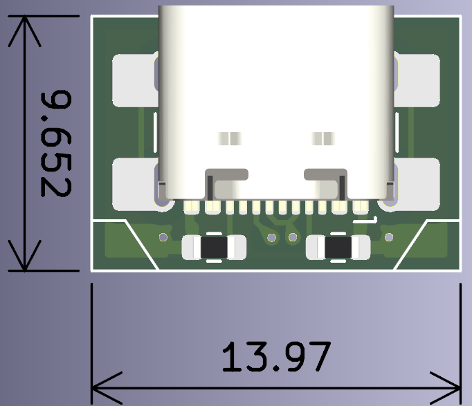
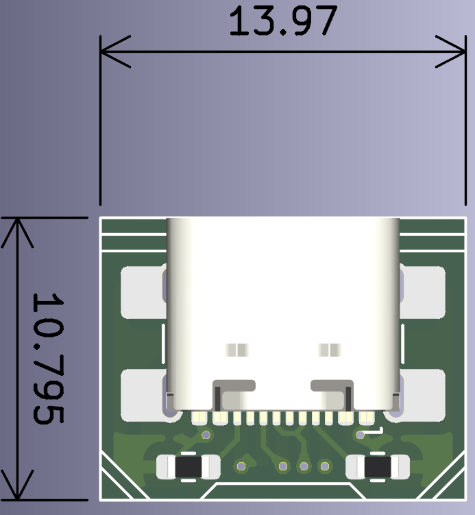
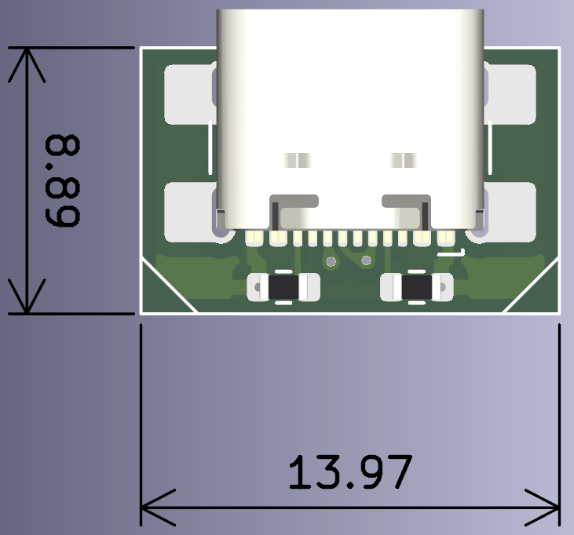
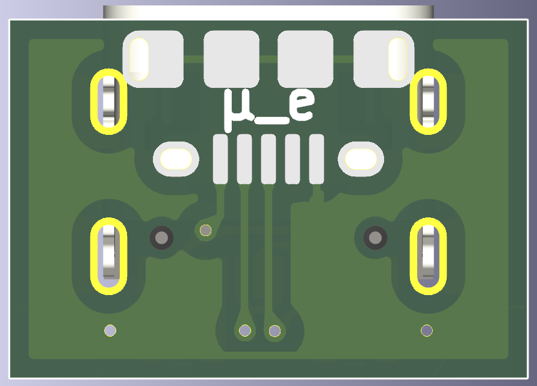
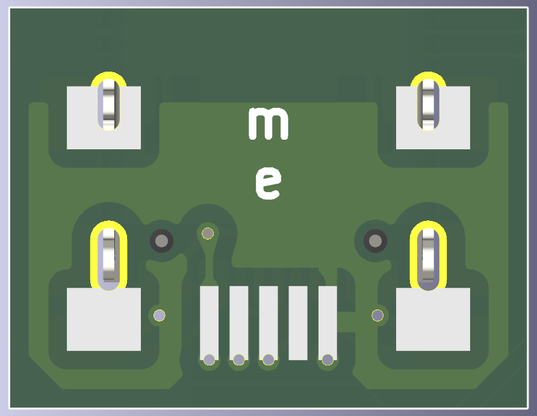
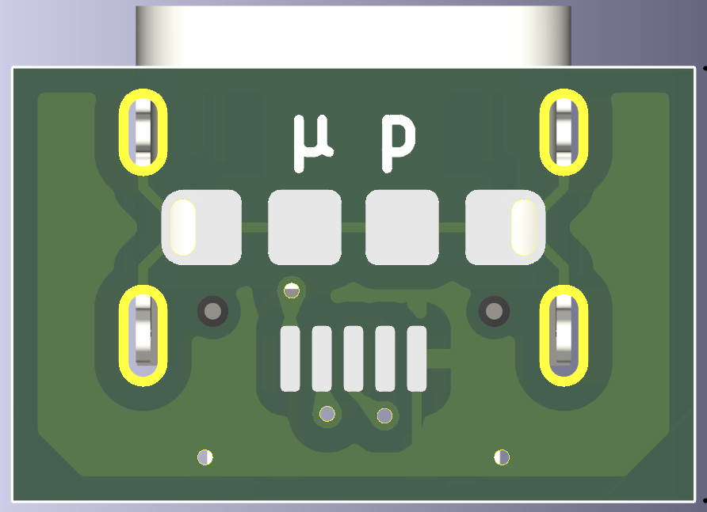

# Type C upgrade kits

Status: Work in progress

Stage: Search for affordable prototyping facility

## About:

This repository contains developments on **_in-situ_** upgrade kits for older Micro/Mini USB ports with USB Type C. The idea is to have flex-PCB (or on very thin FR-4), where:

- USB Type port is located on top layer, accompanied by a pair of 5K1 resistors. 
- Mirrored footprint of a Micro (or Mini) USB port is situated at the bottom layer.
- Use of 0603 size of resistors would keep this project manually solderable

Theoretically, it allows for upgrading older devices by directly soldering of adapter over existing footprint. 

The Content Repository contains three variations of adapters:

- `micro_edge`
    
    prototype of micro USB replacement, where alignment is done on the PCB edge, as is typical for ports.

- `mini_edge`
    
    prototype of mini USB replacement, where alignment is done on the PCB edge, as is typical for ports. It is interesting to note that the mini USB port appears to be of a greater length than that of the type C port.

- `micro_pads`
    
    this prototype is a design for a micro USB replacement, in which is allinged relatively to the pads of micro USB port. This is applicable in instances where the presence of additional circuitry in close proximity to the port renders edge alignment unfeasible. It results in a longer outlet of the Type C port protruding from the PCB edge.  

## Some visuals

|   | Micro Edge | Mini Edge | Micro Pads |
| ------------- | ------------- |  ------------- |  ------------- |
| Top View  |   |   |   |
| Bottom View  |   |   |   |

## Remarks / Thoughts / Things to test

- The utilisation of tape adhesive might be necessary for the positioning.
- Thin FR-4 might provide more rigidity than FlexPCBs
- Silkscreen has multiple perimeters. THis is for manual adjusting of form where space limitation might require it.
- For panelization of multiple designs, I found [this](https://github.com/buganini/Kikakuka) tool useful. 